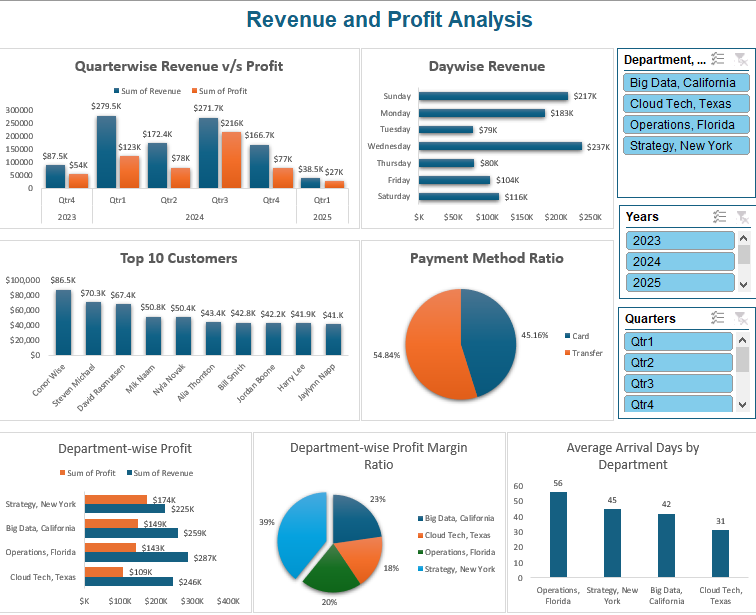

# 🧹 Data Cleaning and Analysis with Power Query

This Excel project demonstrates how **Power Query** was used to transform a raw transactional dataset into a clean, structured format suitable for business analysis. It includes Power Query operations like:
- Removing duplicates
- Fixing column names and data types
- Filling or removing nulls
- Splitting columns
- Creating dynamic summaries

---

## 🧾 Business Context

The dataset contains customer transactions that were initially messy, inconsistent, and unstructured. Clean, reliable data is essential for proper analysis, reporting, and decision-making.

---

## 🎯 Project Objectives

- Clean the raw transactional data using Power Query
- Standardize fields like customer name, payment method, and transaction date
- Create insightful visual summaries to uncover patterns in sales data

---

## 🧰 Tools & Features Used

- Microsoft Excel (Power Query Editor)
- Pivot Tables & Charts
- Data Validation
- Slicers & Named Ranges
- Conditional Formatting

---

## 📊 Key Dashboards & Charts
### 🖼️ Overall Dashboard View 

### 📆 Quarterwise Revenue vs. Profit  
_2023 Q4 and 2024 Q2 were the most profitable quarters with revenues of **$279.5K** and **$271.7K**, respectively. Despite revenue drops in 2025 Q1, profitability remained healthy. Such trends help with budgeting and seasonal strategy planning._

---

### 🗓️ Daywise Revenue  
_**Wednesday ($237K)** and **Sunday ($217K)** had the highest sales, making them peak days for customer activity. Low revenue on **Thursday ($80K)** and **Saturday ($50K)** signals potential areas for improvement via midweek campaigns or loyalty offers._

---

### 🧑 Top 10 Customers  
_**Corey Wise** and **Steven Michael** lead as top contributors with over **$86K** and **$70K** in revenue. Retaining high-value customers through personalized programs could maximize future profits._

---

### 💳 Payment Method Ratio  
_The revenue is fairly split between **Card (45.16%)** and **Transfer (54.84%)**. This insight supports decisions on optimizing payment gateway fees or incentivizing faster processing methods._

---

### 🏢 Department-wise Profit  
_**Strategy, New York** and **Big Data, California** departments contributed the highest revenue and profit, indicating well-aligned operations and product-market fit. Texas and Florida lag slightly behind._

---

### 📊 Department-wise Profit Margin Ratio  
_**Strategy, New York** boasts the highest profit margin (**39%**) followed by **Cloud Tech, Texas (23%)**. This shows operational efficiency and may warrant resource reallocation to maintain profitability._

---

### 🚚 Average Arrival Days by Department  
_**Operations, Florida** has the longest average arrival time (**56 days**) while **Cloud Tech, Texas** is the fastest at **31 days**. Monitoring this metric helps improve logistics and customer satisfaction._

---

## 📌 Interactive Dashboard Features

- **Department Slicer**: Filter by business units like Cloud Tech, Big Data, etc.
- **Year Slicer**: Toggle across 2023–2025
- **Quarter Filter**: Compare seasonal changes and performance
- Fully interactive visuals powered by **Pivot Tables & Charts**

---

## 🔍 Summary of Business Insights

- Focus retention strategies on top 3 customers
- Consider promotional campaigns for low-revenue weekdays
- Optimize logistics in Florida to reduce delivery delays
- Use payment data to negotiate better transaction rates
- Reinvest in high-performing departments like Strategy & Big Data

---

## 🧠 Key Learnings

- Excel can handle full-cycle analytics: cleaning → analysis → visualization  
- Power Query enables reproducible and scalable data prep workflows  
- Clean data leads to clearer, faster insights
- Excel dashboards remain valuable for lightweight business reporting
- Visual storytelling makes insights accessible to non-technical users  ---

