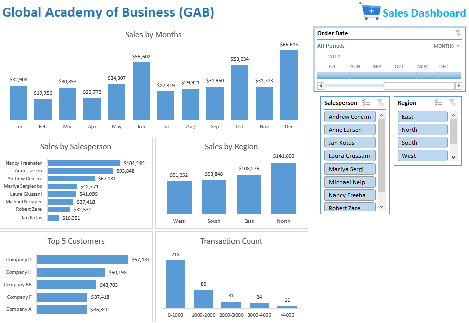

# 📊 Global Academy of Business (GAB) – Sales Dashboard (Excel)

This Excel dashboard analyzes sales performance data from the **Global Academy of Business (GAB)** for the year 2014. It offers dynamic insights by month, region, salesperson, customer, and transaction volume. Built entirely in Excel, this dashboard utilizes slicers, pivot tables, and charts to provide an interactive and intuitive visual reporting experience.

---

## 🧾 Business Scenario

GAB is a sales-driven organization that wanted a visual summary of:
- Monthly sales trends
- Top-performing salespeople and customers
- Sales distribution across regions
- Transaction volumes by size

The management team uses this dashboard during quarterly reviews to assess team performance and make data-driven decisions.

---

## 🎯 Objectives

- Track and compare sales performance by month and region
- Identify top 5 customers and sales representatives
- Analyze transaction volume across different size brackets
- Provide slicers to filter by **month**, **salesperson**, and **region**
- Build an all-in-one interactive dashboard using Excel features only

---

## 🛠 Tools & Techniques Used

- Microsoft Excel 365
- Pivot Tables
- Pivot Charts
- Slicers and Timeline Filters
- Bar Charts and Column Charts
- Data Grouping and Custom Sorting

---

## 📌 Dashboard Overview

### 🖼️ Overall Dashboard View    

---

### 📈 Sales by Months    
_A clearly defined sales trend over 12 months with peaks in June and December._

---

### 👨‍💼 Sales by Salesperson  
_Nancy Freehafer and Anne Larsen lead the sales performance._

---

### 🌍 Sales by Region   
_The North region dominates sales followed by East._

---

### 💰 Top 5 Customers    
_Company D tops the list, indicating strong loyalty or high-ticket purchases._

---

### 🔢 Transaction Count  
_Most transactions are in the 0–1000 range, indicating a large volume of smaller deals._

---

### 🎛️ Interactive Filters  
- **Order Date (Timeline)**
- **Salesperson (Multi-select Slicer)**
- **Region (Multi-select Slicer)**

These filters allow dynamic cross-analysis and dashboard customization.

---

## 🧠 Key Insights

- June and December were the highest revenue months.
- Nancy Freehafer generated over $104K in sales, making her the top salesperson.
- The North region significantly outperformed others.
- A few key customers account for a major portion of revenue.
- Most transactions are relatively small, indicating a volume-based business model.

---

