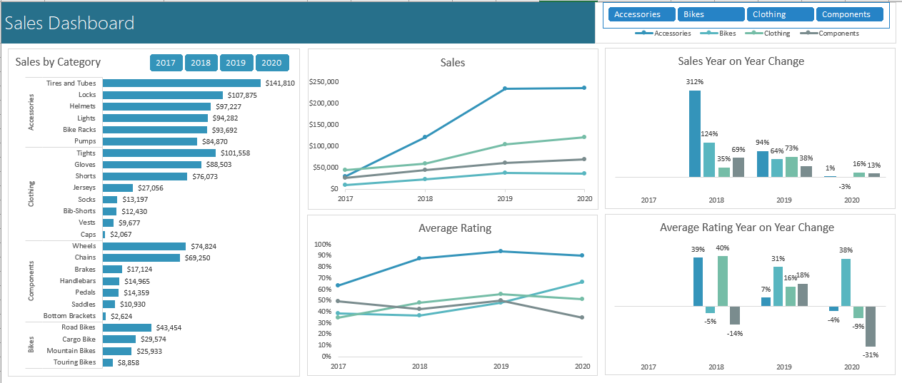

# 📊 Interactive Dashboard using Pivot Tables and Charts

This project showcases the creation of a **multi-year interactive sales dashboard** entirely in Excel.  
The dashboard updates automatically with new data and allows filtering across multiple views using slicers.

---

## 🧾 Business Context
The goal was to present 2017–2020 sales trends and key performance metrics in a single dynamic report that can be refreshed whenever new data is appended.

---

## 🎯 Project Objectives
- Convert raw sales data into an Excel Table for structured references and easy expansion.  
- Build multiple PivotTables and PivotCharts to analyze sales, ratings, and year-on-year changes.  
- Assemble an interactive dashboard with slicers and a shared legend for a clean, user-friendly interface.

---

## 🛠️ Tools & Features Used
- **Excel Tables** (structured references, auto-expanding range)  
- **PivotTables & PivotCharts** (Bar, Line, Column)  
- **Slicers & Report Connections**  
- Percentage Difference calculations (`Show Values As`)  
- Dynamic Refresh (`Refresh All`)

---

## 🚀 Implementation Steps
1. **Prepare the Data**  
   - Formatted the 2017–2019 sales dataset as an **Excel Table** using **Ctrl + T** for structured referencing and future-proofing.

2. **Create PivotTables**  
   - Built **five PivotTables** on a sheet named **Working**, which served as the source for all dashboard charts.

3. **First PivotChart – Sales by Product Category**  
   - Inserted a **bar chart**, added a **Year slicer**, applied comma-separated number formatting, data labels, and removed gridlines/axes.

4. **Second PivotChart – Sales Over Time by Category**  
   - Created a **line chart** and connected it to a dedicated **Category slicer**, formatted with four columns and a clean style.

5. **Third PivotChart – Average Ratings Over Time**  
   - Modified PivotTable values to calculate **Average**, applied **percentage formatting**, and plotted as a line chart.

6. **Year-on-Year Change Charts**  
   - Added two PivotTables with **Show Values As → % Difference From → Previous Year**, then inserted **column charts** and adjusted axis settings to handle negative values.

7. **Dashboard Assembly**  
   - Moved all charts and slicers to a sheet named **Dashboard**, aligning precisely with the **Alt** key for grid snapping.  
   - Configured **Report Connections** so each slicer filters only its intended charts.

8. **Shared Legend**  
   - Created a **dummy chart** that serves solely as a **global legend**, positioned behind slicers to reduce clutter.

9. **Dynamic Update Test**  
   - Appended **2020 data** to the source table and clicked **Refresh All**—all PivotTables and charts updated instantly.

---

## 🖼️ Dashboard View
Include the screenshot of the final dashboard here:

*(Replace `dashboard-overview.png` with the actual exported image of your Excel dashboard.)*

---

## 🔍 Key Insights
- Clear visibility of **category-level sales trends** and **average ratings** across multiple years.
- Immediate detection of **year-on-year percentage changes**, highlighting growth or decline.  
- Fully interactive filters allow stakeholders to explore data by year and category in real time.

---

## 🧠 Lessons Learned
- **Excel Tables** ensure seamless expansion when new data is added.  
- **PivotCharts with slicers** enable powerful interactive dashboards without external BI tools.  
- Thoughtful formatting (dummy legends, clean slicers) improves readability and user experience.