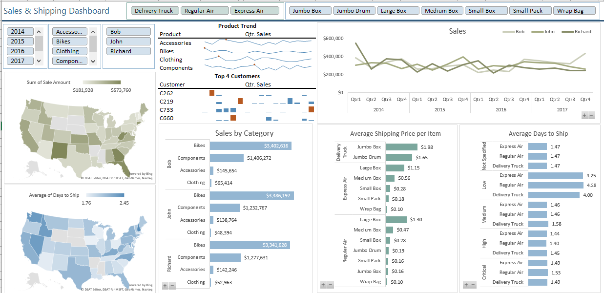

# 📊 Interactive Dashboard with Power Query & Power Pivot

This project demonstrates how **Power Query**, **Power Pivot**, and **DAX** can be combined to create a fully interactive sales and shipping dashboard—entirely within Microsoft Excel.

---

## 🧾 Business Context
The goal was to consolidate multiple CSV files into a unified data model, clean and transform the data, and build an interactive dashboard that allows dynamic exploration of sales, shipping times, and customer trends.

---

## 🎯 Project Objectives
- Import and transform raw CSV files into a clean dataset using **Power Query**.  
- Build a relational **Power Pivot** data model and create DAX calculations for advanced metrics.  
- Design a **single-sheet interactive dashboard** with PivotCharts, map visuals, slicers, and sparklines.

---

## 🛠️ Tools & Features Used
- **Microsoft Excel** (Power Query Editor & Power Pivot)
- **DAX Measures & Calculated Columns**
- PivotTables & PivotCharts  
- Map Charts & Sparklines  
- Slicers for interactive filtering

---

## 🚀 Implementation Steps

### 1️⃣ Data Preparation with Power Query
- **Imported multiple CSV files** using **Data ➜ Get Data ➜ From Folder** to automatically combine all source files.  
- **Cleaned & transformed data**:  
  - Removed unnecessary columns (`Source.Name`).  
  - Verified data types for compatibility.  
  - Created `Sale Amount` with the formula:  
    ```
    =[Order Quantity] * [Unit Sale Price] * (1 - [Discount])
    ```
  - Rounded `Sale Amount` to 2 decimals.  
  - Calculated **Days to Ship** by subtracting `Order Date` from `Ship Date`.  
- Renamed the query as **Sales Data** and loaded it to the **Data Model** (connection only).

---

### 2️⃣ Data Modeling with Power Pivot
- Added **dimension tables**: Customers, Product Categories, Shipping Mode, and Order Priority.  
- Established relationships in **Diagram View**:  
  - `SKU` → Category Table  
  - `Customer ID` → Customers Table  
  - Shipping & Priority fields → their mapping tables  
- Configured the model:  
  - Hid redundant key fields to avoid confusion.  
  - Set **custom sort orders** (e.g., Delivery Truck → Regular Air → Express Air).  
  - Formatted numeric fields (Sale Amount & Shipping Amount as **Currency**, Discount as **Percentage**).

#### Key DAX Calculations
- **Average Shipping Price per Item**  
  ```DAX
  DIVIDE(SUM('Sales Data'[Shipping Amount]), SUM('Sales Data'[Order Quantity]), BLANK())
  ````

- **Year**

  ```DAX
  =FORMAT([Order Date], "yyyy")
  ```
- **Quarter**

  ```DAX
  =CONCATENATE("Qtr", INT((MONTH([Order Date]) + 2) / 3))
  ```
- **Month (Abbrev.)**

  ```DAX
  =FORMAT([Order Date], "MMM")
  ```

---

### 3️⃣ Visualizations & Dashboard Assembly

* Built multiple **PivotTables & PivotCharts** for:

  * **Sales by Category** (Bar Chart)
  * **Sales Over Time by Quarter** (Line Chart)
  * **Average Shipping Price per Item** (Bar Chart)
  * **Average Days to Ship** (Bar Chart)
* Added **Map Charts** for State-level sales and shipping metrics.
* Created **Sparklines** to show:

  * Sales over time by Category
  * Top 4 Customers by Sales

---

### 4️⃣ Final Dashboard Design

* Moved all charts and tables onto a single **Dashboard sheet**.
* Aligned and resized visuals for a clean layout.
* Removed field buttons, legends, and unnecessary gridlines for a polished look.
* Added **interactive slicers** (Year, Category, Product Container, Salesperson, Shipping Mode) and connected them to the relevant PivotTables for synchronized filtering.

---

## 🖼️ Overall Dashboard View

Include a screenshot of the final dashboard here:



---

## 📈 Key Insights

* **Sales & Shipping Trends:** Dynamic filtering by year, category, and shipping mode reveals seasonal patterns and regional bottlenecks.
* **Customer Focus:** Sparklines identify top customers and their purchasing trends at a glance.
* **Operational Efficiency:** Average shipping price and days-to-ship KPIs highlight areas for cost control and service improvements.

---

## 🧠 Lessons Learned

* **Power Query** streamlines large multi-file imports into a single refreshable dataset.
* **Power Pivot + DAX** provides database-level analytics within Excel.
* Interactive dashboards can be built entirely in Excel without external BI tools.

This task highlights Excel’s capability to handle **end-to-end data analytics**—from ingestion to interactive visualization—making it a powerful tool for business intelligence projects.
