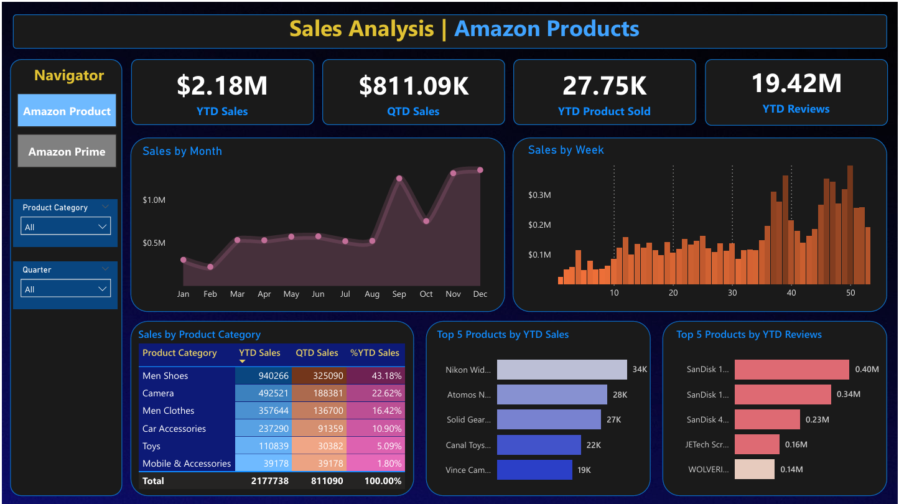
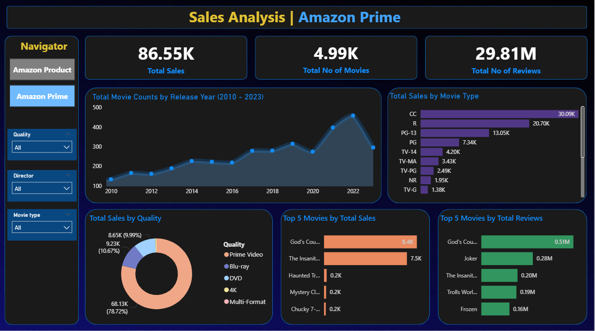

# 📈 Amazon Sales & Prime Movies Dashboard

This **Power BI project** delivers a complete analysis of Amazon product sales and Prime movie performance.  
By integrating data from pre-processed Excel sources, the dashboards track **sales trends, product popularity, customer reviews, and viewing patterns** across categories and time periods.  
Dynamic measures (YTD/QTD Sales) and interactive visuals (stacked bars, area graphs, donut charts) enable stakeholders to make **data-driven decisions** for product strategy, inventory planning, and content optimization.

---

## 🧾 Business Context
Amazon’s retail and Prime streaming services generate vast amounts of data across products, reviews, and viewing activity.  
This project consolidates those datasets to uncover insights on **seasonal sales peaks**, **top-performing products**, and **movie engagement trends**.

---

## 🎯 Project Objectives
- Integrate and clean multiple Excel datasets using **Power Query**.  
- Create a **Date Table** for time-intelligence calculations.  
- Build reusable **DAX measures** for YTD/QTD KPIs.  
- Design two interactive dashboards: **Amazon Product** and **Amazon Prime Movies**.

---

## 🛠️ Tools & Features
- **Power BI Desktop**  
- **Power Query Editor** (data profiling, type conversion)  
- **DAX Measures** (`TOTALYTD`, `TOTALQTD`, `CALENDAR`)  
- Interactive visuals: **Area Chart, Stacked Bar, Donut Chart, KPI Cards**  
- **Page Navigator**, custom theme, and responsive layout

---

## 🚀 Implementation Steps
1. **Data Import & Validation**  
   - Loaded   from Excel files.  
   - Verified integrity with *Column Quality*, *Distribution*, and *Profile*.  
   - Converted key fields (Order Date, Price, Reviews, Release Year) to correct data types.

2. **Date Table Creation**  
   - `Date Table = CALENDAR(MIN(Amazon_Data[Order Date]), MAX(Amazon_Data[Order Date]))`  
   - Added Month Name, Month Number, Week, and Quarter columns.  
   - Established a one-to-many relationship: `Amazon_Data[Order Date] → Date Table[Date]`.

3. **DAX Measures**  
   - `YTD Sales`, `QTD Sales`, `YTD Product Sold`, `YTD Reviews` using `TOTALYTD` / `TOTALQTD`.  

4. **Amazon Product Dashboard**  
   - Slicers: **Product Category**, **Quarter**.  
   - KPI Cards: YTD Sales, QTD Sales, YTD Products Sold, YTD Reviews.  
   - Area Chart: **Sales by Month**.  
   - Stacked Bars: **Sales by Week**, **Top 5 Products by YTD Sales**, **Top 5 Products by YTD Reviews**.  
   - Table: Product Category with YTD & QTD metrics and %YTD contribution.

5. **Amazon Prime Movies Dashboard**  
   - Slicers: **Quality**, **Director**, **Movie Type**.  
   - KPI Cards: Total Sales, Total Movies, Total Reviews.  
   - Area Chart: **Movie Counts by Release Year (2010–2023)**.  
   - Stacked Bar: **Sales by Movie Type**, **Top 5 Movies by Total Sales**, **Top 5 Movies by Reviews**.  
   - Donut Chart: **Sales by Quality**.

6. **Design & Formatting**  
   - Dark blue theme, rounded corners, consistent fonts.  
   - Page Navigator for quick dashboard switching.  
   - Visual shadows and clean layouts for readability.

---

## 📊 Key Findings

### Amazon Product Dashboard
- **KPIs:** YTD Sales **$2.18M**, QTD Sales **$811.09K**, YTD Reviews **19.42M**, YTD Products Sold **27.75K**.  
- **Seasonality:** Sales spike in **Nov–Dec**, dip in **Feb**, highlighting strong Q4 performance.  
- **Category Leaders:** **Men Shoes (43.18%)**, followed by **Camera (22.62%)** and **Men Clothes (16.42%)**.  
- **Top Products:** Nikon, Atomos, and Solid Gear dominate YTD Sales. SanDisk leads in customer reviews.

### Amazon Prime Movies Dashboard
- **KPIs:** Total Sales **$86.55K**, Movies **4.99K**, Reviews **29.81M**.  
- **Growth:** Movie releases steadily increased from 2010, with rapid expansion after 2018.  
- **Revenue Drivers:** CC, R, and PG-13 ratings lead sales.  
- **Quality Preference:** **Prime Video** accounts for **78.72% of sales**, confirming digital streaming dominance.  
- **Top Movies:** *God’s Country*, *The Insanity*, and *Joker* lead in sales and reviews.

---

## 🖼️ Dashboard Views
-   
- 

---

## 🧠 Conclusion
The Amazon Sales and Prime Movies dashboards provide a **comprehensive, interactive view of e-commerce and streaming performance**.  
Stakeholders can quickly explore **seasonal trends**, **top products**, and **customer engagement**, enabling better **inventory planning**, **content strategy**, and **market forecasting**.  
The clean theme and DAX-driven KPIs ensure scalability for future enhancements like **seasonal trend prediction** and **cross-platform comparisons**.
