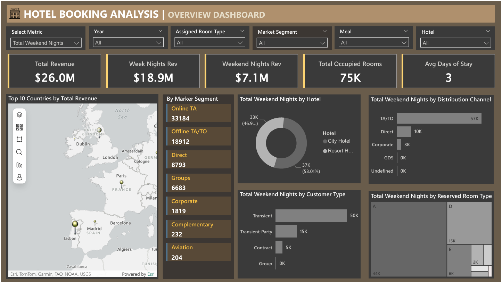

````markdown
# 🏨 Hotel Booking Analysis Dashboard 

This **Power BI project** provides a deep analysis of hotel booking data to uncover insights on **room occupancy, booking trends, cancellations, revenue, and customer behavior**.  
Interactive dashboards, dynamic selectors, and advanced DAX calculations enable hotel management to **track performance across room types, market segments, booking channels, and regions**, helping guide **operational, financial, and marketing decisions**.

---

## 🧾 Business Context
Hotels need to understand booking patterns, customer segments, and revenue sources to improve occupancy, reduce cancellations, and optimize pricing.  
This project consolidates multi-source booking data into a single interactive platform for data-driven decision-making.

---

## 🎯 Project Objectives
- Analyze **room occupancy** and **revenue performance** across weekdays, weekends, and geographic regions.
- Identify **cancellation patterns** and their impact on revenue.
- Provide **dynamic KPI summaries** and **period-based analysis** (Week, Month, Quarter).
- Enable drill-down into **market segments, booking channels, and customer types**.

---

## 🛠️ Tools & Features
- **Power BI Desktop**
- **Power Query Editor** for data cleaning & transformations
- **DAX** for calculated columns, advanced measures, and KPI logic
- **Interactive visuals**: KPI Cards, Area Charts, Stacked Columns/Bars, Treemaps, ArcGIS Map, Multi-Row Cards
- Custom **dark theme**, chocolate palette, rounded corners, and consistent typography

---

## 🚀 Implementation Steps

### 1️⃣ Data Import & Preparation
- Imported pre-processed hotel booking data (CSV) and validated row counts.
- In **Power Query Editor**:
  - Enabled *Column Quality, Distribution, Profile* to ensure **100% valid values**.
  - Converted *Arrival Date* to Date type.
  - Created calculated fields:
    - `Weekend Rev = [Stays In Weekend Nights] * [Adr]`
    - `Week Nights Revenue = [Stays In Week Nights] * [Adr]`

### 2️⃣ Date Table
- Created a dedicated **Date Table**:
  ```DAX
  Date Table = CALENDAR(MIN('hotel data'[Arrival Date]), MAX('hotel data'[Arrival Date]))
  ```

* Added columns: Month, Month Number, Year, Week, Quarter, Quarter Name.
* Established a **many-to-many relationship** between `Date Table[Date]` and `hotel data[Arrival Date]`.

### 3️⃣ Key DAX Measures
* **Totals**
  * `Total Rooms Booked`
  * `Total Occupied Rooms` (excluding cancellations)
  * `Total Revenue`, `Weekend Nights Rev`, `Week Nights Rev`
* **Averages & Ratios**
  * `Occupancy Rate = [Total Occupied Rooms] / [Total Rooms Booked]`
  * `Avg Daily Rate (ADR)`
  * `RevPAR = [Avg Daily Rate] * [Occupancy Rate]`
* **Time Intelligence**
  * Weekly/Monthly/Quarterly revenue and occupancy calculations using `SUMX` and `AVERAGEX`.

### 4️⃣ Metric & Period Selectors
* Created **Select Metric** and **Select Period** tables to enable dynamic switching of KPIs and time periods on the dashboard.

### 5️⃣ KPI Summary Dashboard
* Slicers: Period, Year, Assigned Room Type, Market Segment, Country, Hotel.
* Cards & Area Charts for:
  * Occupancy Rate
  * Total Days of Booking
  * Total Occupied Rooms
  * Weekday vs. Weekend Nights
  * Average Daily Rate
  * Revenue Per Available Room (RevPAR)
  * Total Canceled Bookings
* Stacked Column Charts for **Total Revenue** and **Total Occupied Rooms** by Week.

### 6️⃣ Overview Dashboard
* Slicers: Metric, Year, Assigned Room Type, Market Segment, Meal, Hotel.
* Cards for: Total Revenue, Weeknight & Weekend Revenue, Total Occupied Rooms, Avg Days of Stay.
* Visuals:
  * **ArcGIS Map** – Top 10 Countries by Revenue
  * **Multi-row Card** – Market Segment details
  * **Pie Chart** – Hotel share by selected metric
  * **Stacked Bar Charts** – Distribution Channel & Customer Type
  * **Treemap** – Reserved Room Type proportions

---

## 📊 Key Findings
### 📌 KPI Highlights
* **Occupancy Rate:** **63 %** – moderate utilization.
* **Total Occupied Rooms:** **75 K**.
* **Average Daily Rate (ADR):** **\$102**.
* **RevPAR:** **\$64** – revenue per available room.
* **Total Cancelled Bookings:** **44 K** (\~37 % cancellation rate).

### 💵 Revenue Insights
* **Total Revenue:** **\$26 M**
  * Weeknight Revenue: **\$18.9 M (72.7 %)**
  * Weekend Revenue: **\$7.1 M (27.3 %)**

### 📅 Booking Patterns
* Weekday stays dominate (**185 K nights**) vs. **70 K weekend nights**.
* Average stay length: **3 days**.

### 🌍 Market & Channel Analysis
* **Top 10 revenue-generating countries** include **London, Paris, Dublin**, and North Sea regions.
* **Online Travel Agents (OTA)** account for **33 K bookings**—the largest booking channel.
* **Direct bookings** remain low (\~8.8 K), indicating room for growth.

### 🏨 Room & Hotel Insights
* City hotels attract more weekend stays (**37 K nights**) compared to resort hotels.
* Room Types **A** and **D** are most frequently reserved.

### ⚠️ Operational Concerns
* High **cancellation rate (\~37 %)** may require improved policies or incentives to reduce losses.

---

## 🖼️ Dashboard View



---

## 🧠 Conclusion
The **Hotel Booking Analysis Dashboard** delivers a **comprehensive, interactive view** of hotel performance.
By combining **Power Query transformations**, **DAX-based KPIs**, and **dynamic visuals**, stakeholders can:
* Monitor **occupancy, revenue, and cancellations** in real-time.
* Compare performance across **markets, channels, and periods**.
* Identify **growth opportunities** such as boosting direct bookings or targeting underperforming regions.

This solution empowers hotel managers and marketing teams to **optimize pricing strategies, improve guest retention, and increase overall profitability**.
