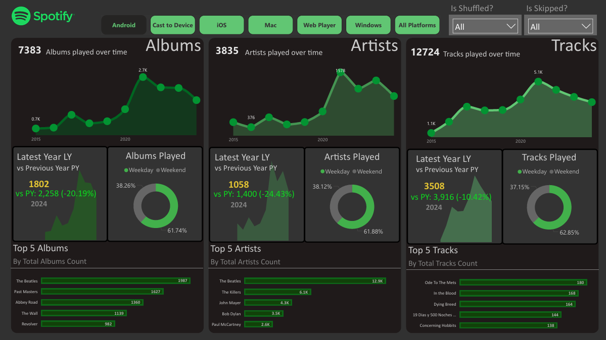

````markdown
# 🎶 Spotify Listening History Analysis
This **Power BI project** analyzes personal Spotify listening history to uncover **music preferences, platform usage, and time-based trends**.  
Through **dynamic DAX measures**, platform-specific dashboards, and visually rich KPIs, the solution provides insights into **favorite artists, albums, and tracks**, while comparing **year-over-year engagement** and **weekday vs. weekend listening behavior**.

---
## 🧾 Business Context
Understanding listening habits helps identify favorite genres, optimize playlists, and detect changes in engagement over time.  
This project consolidates Spotify’s streaming history into a single interactive platform for **personal trend analysis and content discovery**.

---

## 🎯 Project Objectives
- Track **top artists, albums, and tracks** across all platforms.
- Compare **year-over-year changes** in listening volume.
- Analyze **weekday vs. weekend** listening distribution.
- Highlight **platform-specific trends** and potential data gaps.

---

## 🛠️ Tools & Features
- **Power BI Desktop** for data modeling and visualization  
- **Power Query Editor** for data cleaning and transformations  
- **DAX** for custom time intelligence and KPIs  
- **Interactive visuals**: Area Charts, Donut Charts, Top-N Bar Charts, Cards, and Page Navigation  
- Dark theme with **Spotify-inspired green & white palette**, rounded corners, and branded logo

---

## 🚀 Implementation Steps

### 1️⃣ Data Import & Cleaning
- Loaded pre-processed Spotify history (CSV).  
- Enabled *Column Quality, Distribution, Profile* to ensure **100 % valid values**.  
- Converted `ts` to **DateTime**.  
- Added calculated columns:
  - `Track Played Date`  
  - `Track Played Time`

### 2️⃣ Date Table
Created a dedicated Date Table:
```DAX
Date Table = CALENDAR(
    MIN(spotify_history[Track Played Date]),
    MAX(spotify_history[Track Played Date])
)
````

* Added **Year**, **Day**, and a `Weekday_Weekend` flag:

  ```DAX
  Weekday_Weekend =
  IF(WEEKDAY('Date Table'[Date],2) <= 5,"Weekday","Weekend")
  ```
* Related `spotify_history[Track Played Date]` to `Date Table[Date]` (one-to-many).

### 3️⃣ Core DAX Measures

* **Distinct Counts**: `No of Albums`, `No of Artists`, `No of Tracks`
* **Time Intelligence**: `CurrentYearAlbums`, `PreviousYearAlbums`, and similar for Artists/Tracks
* **YoY KPIs**:

  ```DAX
  PY & YoY Albums KPI =
      "vs PY: " & FORMAT([PreviousYearAlbums],"#,##0")
      & " (" & FORMAT(([CurrentYearAlbums]-[PreviousYearAlbums])/[PreviousYearAlbums],"0.00%") & ")"
  ```
* **Min/Max**: identify best and worst years for Albums, Artists, and Tracks.

### 4️⃣ Dashboard Design

* **Header Slicers**: Year, Platform, Is Shuffled?, Is Skipped?
* **Top Row**: Trend Area Charts for Albums, Artists, Tracks over time.
* **Middle Row**: KPI Cards for current-year counts with YoY comparison; Donut charts for **Weekday vs. Weekend** listening.
* **Bottom Row**: Top-5 Bar Charts for Albums, Artists, Tracks.
* **Page Navigation**: Separate dashboards for **Android, iOS, Mac, Windows, Web Player, Cast**, and a combined **All Platforms** view.

---

## 📊 Key Insights

### 🎧 Listening Trends

* **Albums Played:** 7,907 total; notable **decline in 2024** (-21.8 % albums, -26.4 % artists).
* **Weekday vs. Weekend:** \~63 % of listening occurs on **weekdays**, confirming stronger engagement during the workweek.

### ⭐ Top Content

* **Artists:** The Beatles (13.6 K plays) dominate, followed by The Killers (6.9 K) and John Mayer (4.9 K).
* **Albums:** *The Beatles* (2,063 plays), *Past Makeries* (1,672), *Abbey Road* (1,429).
* **Tracks:** “Oaks To The Mars” (207 plays) leads individual track popularity.

### 📉 Year-over-Year Changes

* 2024 vs Previous Year:

  * **Albums:** -21.8 % (1,824 vs 2,333)
  * **Artists:** -26.4 % (1,071 vs 1,455)
  * **Tracks:** -11.5 % (3,568 vs 4,031)

### 🖥️ Platform Usage

* Listening spans **Android, iOS, Mac, Windows, Web Player, and Cast to Device**.
* Some platforms show **incomplete data**, highlighting potential gaps in Spotify’s tracking.

### 🎯 Overall Observations

* **Classic rock dominance** shows enduring appeal of legacy artists.
* **Weekday listening** suggests prime windows for targeted promotions.
* **Declining engagement** may reflect changing habits or competing services.

---

## 🖼️ Dashboard Preview


---

## 🧠 Conclusion

The **Spotify Analysis Dashboard** offers a **data-rich, interactive view** of personal listening habits.
By combining **Power Query transformations**, **advanced DAX measures**, and **clean visual design**, it enables:

* Year-over-year tracking of **albums, artists, and tracks**.
* Insights into **platform usage** and **day-type engagement**.
* Quick identification of **favorite content** and changing preferences.

This approach can easily scale to **genre-level or device-level analytics**, providing deeper understanding of listening behavior and helping guide **personalized music discovery** in the future.
