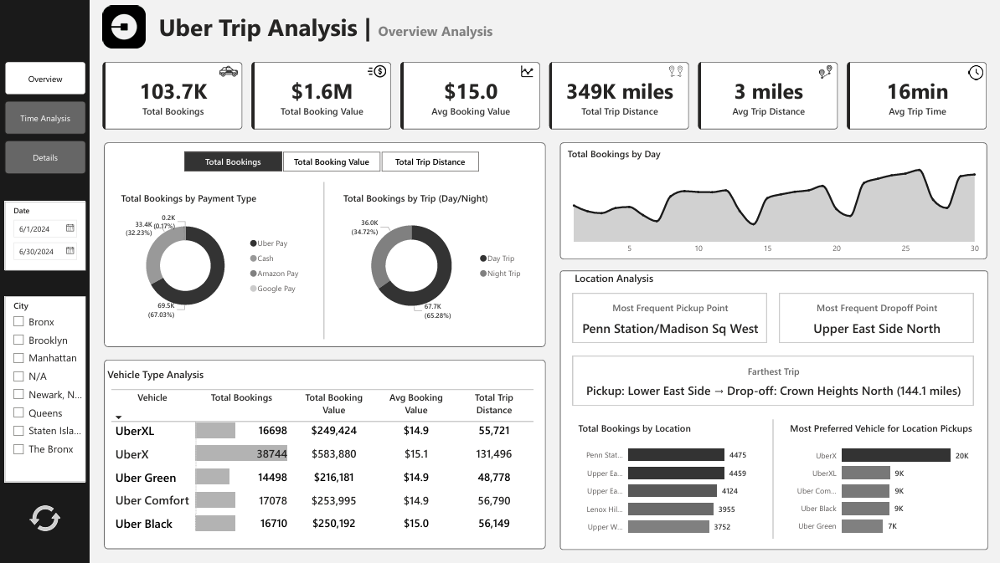
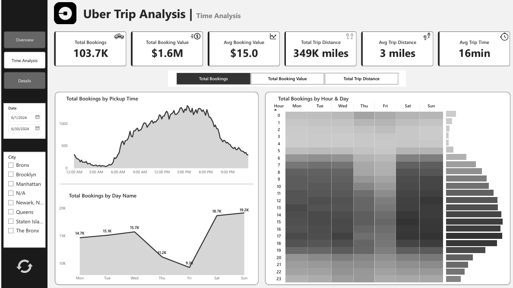
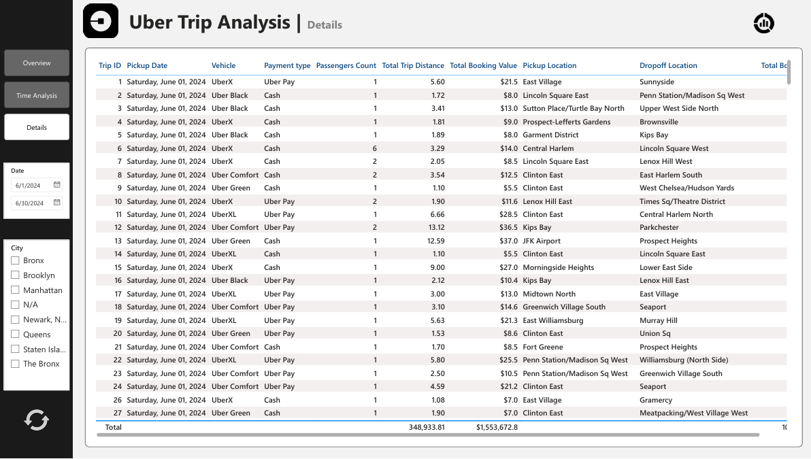

````markdown
# 🚖 Uber Trip Analysis
This **Power BI project** analyzes Uber trip data to reveal **booking trends, revenue insights, time-based patterns, and location behavior**.  
The interactive dashboards enable **fleet optimization, pricing strategies, and improved customer experience** through rich KPIs and drill-through capabilities.

---

## 🧾 Business Context
Ride-hailing companies must track **demand peaks, revenue flows, and route efficiency** to allocate resources and improve operations.  
This dashboard transforms raw Uber data into an **actionable decision-support system** for business stakeholders.

---

## 🎯 Project Objectives
- Monitor **total bookings, revenue, and trip efficiency**.  
- Identify **popular pickup/dropoff points** and vehicle preferences.  
- Reveal **peak hours and day-of-week demand**.  
- Provide **drill-through details** for operational and pricing strategies.

---

## 🛠️ Tools & Features
- **Power BI Desktop** for modeling & visualization  
- **Power Query Editor** for cleaning and profiling  
- **Advanced DAX** for KPIs and dynamic measures  
- **Custom visuals**: Cards, Donuts, Area/Line Charts, Matrix, and Bookmarks  
- Dark theme with **Uber-style palette**, rounded corners, and interactive page navigation

---

## 🚀 Implementation Steps

### 1️⃣ Data Import & Cleaning
- Loaded **Uber Trip Details** and **Location Table** from Excel.  
- Verified **100 % valid values**, **0 % errors** using Column Quality/Distribution/Profile.

### 2️⃣ Relationship Setup
- Active: `Trip Details[PULocationID] → Location Table[LocationID]`  
- Inactive: `Trip Details[DOLocationID] → Location Table[LocationID]`  
- One-to-Many, single direction.

### 3️⃣ Calendar Table
```DAX
Calendar Table =
CALENDAR(
    MIN('Trip Details'[Pickup Date]),
    MAX('Trip Details'[Pickup Date])
)
````

* Linked `Trip Details[Pickup Date]` to `Calendar Table[Date]`.
* Extracted **Day, Day Name, Hour** for time analysis.

### 4️⃣ KPI Measures

Key examples:

```DAX
Total Bookings = COUNT('Trip Details'[Trip ID])

Total Booking Value =
SUM('Trip Details'[fare_amount]) + SUM('Trip Details'[Surge Fee])

Avg Trip Time =
VAR AvgMinutes =
    AVERAGEX('Trip Details',
        DATEDIFF('Trip Details'[Pickup Time],
                 'Trip Details'[Drop Off Time], MINUTE))
RETURN FORMAT(AvgMinutes, "0") & " min"
```

Other measures include **Avg Booking Value, Total/Avg Trip Distance**, and a **Dynamic Measure Selector** to switch visuals among bookings, value, or distance.

### 5️⃣ Visual Design

* **Overview Dashboard**

  * Cards: Total Bookings, Total Booking Value, Avg Booking, Total & Avg Distance, Avg Trip Time.
  * Donut Charts: Payment Type & Day/Night Trip Distribution.
  * Matrix: Vehicle Type vs KPIs with conditional data bars.
  * Area Chart: Daily booking trends.

* **Location Analysis**

  * Cards: *Most Frequent Pickup/Dropoff* and *Farthest Trip* (using `USERELATIONSHIP` DAX).
  * Stacked Bars: Top 5 Locations by Bookings; Preferred Vehicle per Pickup Zone.

* **Time Analysis**

  * Area Chart: Pickup Time in 10-minute bins.
  * Line Chart: Bookings by Day Name.
  * Matrix: Hour-of-Day vs Day-of-Week heatmap.

* **Details Page**

  * Drill-through grid with Trip ID, Vehicle, Payment Type, PU/DO locations.
  * Bookmarks and Reset icon to clear slicers.

---

## 📊 Key Insights

### 🚘 Booking & Revenue

* **Total Bookings:** **103.7 K** trips generating **\$1.6 M**.
* **Average Booking Value:** **\$15.0** per trip.
* **Farthest Trip:** Lower East Side → Crown Heights North (**144.1 miles**).

### 🚖 Vehicle Type

* **Most Popular:** **UberX** (37.4 % of bookings, \$583.9 K revenue).
* **Next:** Uber Comfort (16.5 %) and UberXL (16.1 %).
* **Avg Fare:** \~\$15 across vehicle types.

### ⏰ Time & Demand

* **Peak Hours:** Morning & evening rush (≈8 AM and 6 PM).
* **Weekend Spike:** Higher demand on Sundays.

### 📍 Location & Route

* **Top Pickup:** Penn Station/Madison Sq West.
* **Top Dropoff:** Upper East Side North.
* **High-Demand Zones:** Penn Station (\~4.5 K trips), Upper East Side (\~4.5 K trips).

### 💡 Actionable Takeaways

* **Scale UberX capacity** in high-demand areas.
* Promote **off-peak/night rides** to balance load.
* Encourage **digital payments** for efficiency.
* Use insights on **long-distance trips** for premium pricing.

---

## 🖼️ Dashboard Preview





---

## 🧠 Conclusion

The **Uber Trip Analysis Dashboard** converts raw ride data into a **powerful decision-making tool**.
Through **dynamic DAX measures**, interactive visuals, and drill-through exploration, stakeholders can:

* Optimize **fleet distribution** and **pricing models**.
* Target **high-demand locations and time slots**.
* Improve **customer satisfaction** with data-driven strategies.

This project also lays the groundwork for **predictive analytics** and deeper segmentation to further enhance operational efficiency and profitability.
