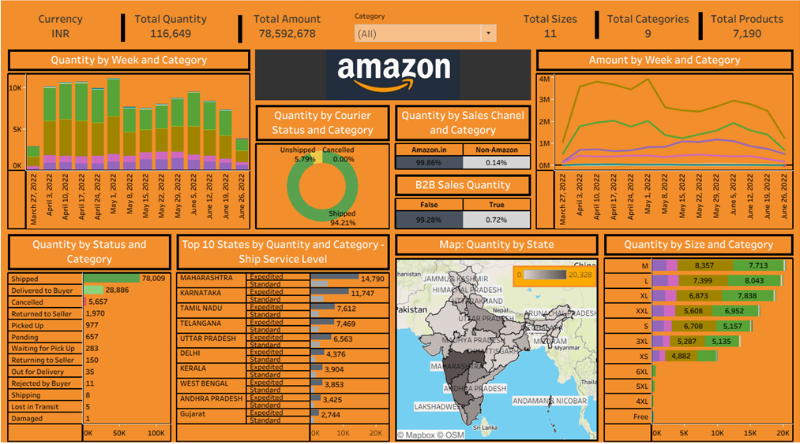

# 🛒 Amazon Sales Dashboard 

This **Tableau project** analyzes Amazon sales data to reveal trends in **geography, product size, shipping behavior, customer preferences, and order fulfillment**.  
Using an **interactive dashboard** powered by pre-processed CSV data, it provides a comprehensive visual overview of **quantities sold, sales amount, courier statuses, and shipping service levels**.

---

## 🎯 Objectives
- Visualize **sales quantity and revenue** across states, sizes, categories, and time.  
- Track **shipping performance** (courier status, service levels, B2B/B2C).  
- Provide **KPI snapshots** of total sales, revenue, categories, and products.  
- Enable **interactive filtering** for strategic decisions in inventory and logistics.

---

## 🛠️ Tools & Techniques
- **Tableau Desktop** for data visualization  
- **CSV Data Source:** `Amazon Sales Report.csv`  
- Visuals: **Maps, Bar & Line Charts, Donut Charts, Highlight Tables, KPIs**  
- Interactive filters for **Category, State, Ship Service Level**  
- Consistent **branding with Amazon logo**

---

## 🚀 Implementation Steps

### 1️⃣ Data Load
- Connected to `Amazon Sales Report.csv` containing fields: *Order ID, Date, Status, ASIN, Category, Qty, Ship-State, Ship-Country, Amount*, etc.

### 2️⃣ Key Worksheets
- **Map – Quantity by State**: Filled map colored by `Qty`, labeled by `Ship-State`, filtered by `Category`.
- **Stacked Bar – Quantity by Size & Category**: Size on rows, Qty on columns, Category as color, sorted descending.
- **Top 10 States by Qty & Ship Service Level**: Horizontal stacked bar segmented by `Ship-Service-Level`, limited to top 10 states.
- **Quantity by Status & Category**: Bar chart comparing shipped vs cancelled quantities.
- **Weekly Trends – Qty & Amount**: Line charts of weekly `Qty` and `Amount` by category.
- **Courier Status Donut**: Dual-axis donut showing percentage of quantities by courier status.
- **Sales Channel Heatmap**: Quantity across sales channels, percent of total.
- **KPIs**: Total Quantity, Total Amount, Total Sizes, Total Categories, Total Products.

### 3️⃣ Dashboard Assembly
- Combined all sheets into a **single interactive dashboard**.
- Added **Category filter** synced across views.
- Included **Amazon logo** and consistent fonts/colors.

---

## 📊 Key Findings
- **Peak Periods:** Strong spikes in early April–May 2022, with quantities near **10,000 units** and revenue around **₹4M**.
- **High Shipment Success:** **94.21 %** shipped, **5.79 %** unshipped, negligible cancellations.
- **Dominant Channel:** **Amazon.in** drives **99.86 %** of sales; other channels only **0.14 %**.
- **Sales Type:** **B2C** accounts for **99.39 %**, B2B only **0.61 %**.
- **Returns:** **1,970 units** returned to seller—a notable operational metric.
- **Top States:** Maharashtra (**14,790** units), Karnataka (**11,747**), Tamil Nadu (**7,612**).
- **Popular Size:** **M** leads all sizes in quantity sold.
- **Overall Metrics:**  
  - **Total Quantity:** **116,649 units**  
  - **Total Revenue:** **₹78,592,678**  
  - **Unique Sizes:** **11**  
  - **Categories:** **9**  
  - **Distinct Products (ASINs):** **7,190**

---

## 🖼️ Dashboard Preview

---

## 🧠 Conclusion
The **Amazon Sales Dashboard** provides a **holistic, interactive visualization** of e-commerce performance.  
By integrating **quantity, revenue, shipping, product size, and regional data**, stakeholders can:

- Identify **high-performing states and categories**  
- Detect **peak sales periods**  
- Monitor **fulfillment and courier performance**  
- Guide **inventory planning and logistics**

This scalable Tableau solution lays the groundwork for advanced analytics such as **forecasting, churn detection, and customer segmentation**.
