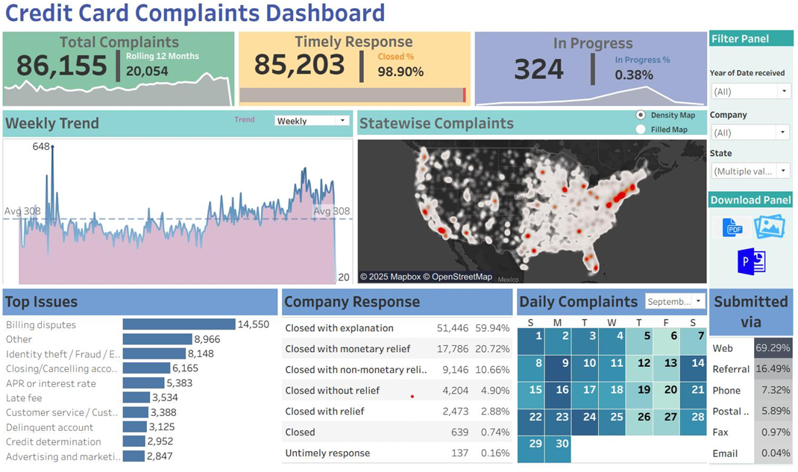

# 💳 Credit Card Complaints Dashboard

This **Tableau dashboard** provides a **complete view of consumer credit-card complaints**, enabling financial institutions and regulators to monitor service quality, identify problem areas, and track response performance.  
It combines **KPIs, sparklines, progress bars, calendar heatmaps, and geospatial maps** to present both high-level summaries and detailed complaint trends.

---

## 🎯 Objectives
- Monitor **total complaint volume** and **rolling 12-month trends**.  
- Measure **timely response rate**, **in-progress cases**, and closure performance.  
- Analyze **geographic hotspots**, **common issues**, and **submission channels**.  
- Provide **interactive filters** for time, state, and communication method.

---

## 🛠️ Tools & Data
- **Tableau Desktop**  
- **Data Source:** `Credit Card Dashboard.xlsx`  
- Visuals include: **sparklines, dual-axis progress bars, density & filled maps, calendar heatmap, highlight tables**.

---

## 🚀 Implementation Steps

### 1️⃣ Data Connection
- Connected to the Excel file `Credit Card Dashboard.xlsx` and verified data integrity.

### 2️⃣ KPI & Trend Sheets
- **Total Complaints** – Single large number using `SUM(Number of Records)`.
- **Rolling 12 Months** – Parameter & calculated field to display complaints from the latest 12 months.
- **Timely Response** – Calculated field for on-time replies.
- **Closed %** – Percent of total complaints closed within the defined SLA.
- **Progress Bar** – Dual-axis bar to visualize Closed %.
- **In Progress** – Count and % of open complaints.
- **Sparklines & Trend** – Dual-axis line/area charts for weekly and monthly complaint trends.

### 3️⃣ Geographic & Category Analysis
- **Density & Filled Maps** – Show complaint concentration and state-wise totals.  
- **Top Issues** – Horizontal bar chart for most frequent complaint types.  
- **Company Response** – Percent-of-total breakdown of resolution types.  
- **Calendar Heatmap** – Daily complaint counts to reveal seasonal or billing-cycle spikes.  
- **Submitted Via** – Percent-of-total by channel (Web, Phone, etc.).

### 4️⃣ Dashboard Layout
- Custom size: **1500 × 900 px**.  
- Horizontal & vertical containers for a clean grid.  
- Floating KPI cards, sparklines, maps, and bar charts with coordinated filters.  
- Added **download panel** for exporting PDF, images, and PowerPoint.  
- Color-coded KPIs and progress bars for instant readability.

---

## 📊 Key Findings
- **Total Complaints:** **86,155** overall, with **20,054** in the latest 12 months.  
- **High Responsiveness:** **98.9 %** timely response rate.  
- **Low Open Cases:** Only **324 (0.38 %)** still in progress.  
- **Geographic Hotspots:** California, Texas, and New York record the highest volumes.  
- **Common Issues:** Billing disputes, fraud, and account closures dominate.  
- **Submission Channels:** **Web** is the primary method (**~69 %** of all complaints).  
- **Trend Insight:** Weekly spikes align with billing cycles or external financial events.

---

## 🖼️ Dashboard Preview

---

## 🧠 Conclusion
The **Credit Card Complaints Dashboard** transforms raw complaint records into **actionable insights**.  
It empowers decision-makers to:
- **Pinpoint service bottlenecks** quickly,
- **Maintain high closure performance**, and
- **Strengthen proactive customer engagement**.

Despite strong on-time responses, the steady flow of complaints underscores the need for **continuous service improvements and customer education**.
