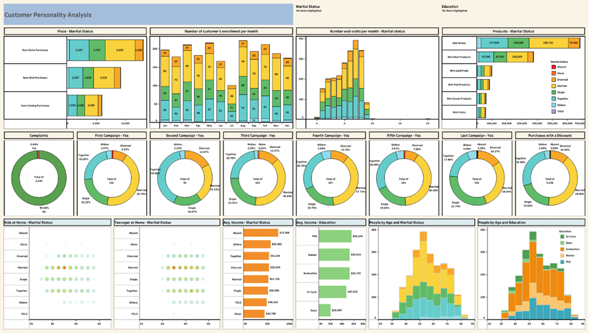

# 🧍‍♀️ Customer Personality Analysis Dashboard

This **Tableau dashboard** analyzes customer demographics, purchasing behavior, and marketing campaign responses using the **`marketing_campaign.csv`** dataset.  
It uncovers **who the customers are, how they shop, and which campaigns drive engagement**, enabling data-driven marketing and sales strategies.

---

## 🎯 Objectives
- Understand **purchasing patterns** across store, web, and catalog channels.  
- Evaluate **campaign performance** and customer responses.  
- Explore **demographic segments**: age, education, marital status, income, and family composition.  
- Identify opportunities for **personalized marketing** and **ROI optimization**.

---

## 🛠️ Tools & Data
- **Tableau Desktop**  
- **Dataset:** `marketing_campaign.csv`  
- Visuals include **bar charts, donut charts, histograms, density plots, and KPIs**.

---

## 🚀 Implementation Steps

### 1️⃣ Data Preparation
- Connected Tableau to `marketing_campaign.csv`.
- Verified field types (numeric, date, dimension) for accurate aggregation.

### 2️⃣ Key Visual Sheets
- **Purchases vs. Marital Status** – Bar chart comparing web, catalog, and store purchases by marital group.
- **Monthly Enrollments** – Bar chart of new customer sign-ups per month, color-coded by marital status.
- **Web Visits** – Bar chart of monthly web visits segmented by marital status.
- **Product Preferences** – Multi-measure bar chart showing wine, meat, and other product purchases by marital status.
- **Complaints** – Donut chart showing % of customers who submitted complaints (~1% overall).
- **Campaign Responses** – Series of donut charts for Campaigns 1–5 and the Last Campaign, segmented by marital status.
- **Discount Purchases** – Donut chart of customers using discounts.
- **Income by Marital Status & Education** – Bar charts of average income for each group.
- **Age Distribution** – Histogram of customer ages, colored by marital status or education.
- **Households with Kids/Teenagers** – Density plots to visualize families with children or teens.

### 3️⃣ Dashboard Layout
- Custom size: **1850 × 1050 px**.  
- All 18 sheets assembled with consistent **color coding, borders, and typography**.  
- Filters for **marital status, education, and campaign acceptance** for interactive exploration.

---

## 📊 Key Insights
- **Store Dominance:** Store purchases exceed web and catalog, led by **married & “together” customers**.
- **Product Popularity:** **Wines** are top sellers, followed by meat products—again dominated by married customers.
- **Seasonality:** Customer sign-ups peak in **May** and **September**, highlighting seasonal marketing opportunities.
- **Low Complaints:** Only about **1%** of customers lodged complaints, indicating high satisfaction.
- **Campaign Success:** **Campaign 1** and the **Last Campaign** achieved the highest acceptance, especially among married/together segments.
- **Income & Education:** Customers with **Master’s or PhD** report the highest average income—ideal for premium offerings.
- **Age Demographics:** Core customer base is **30–50 years old** across all segments.
- **Family Factors:** Households with **kids or teenagers** are more prevalent among married/together groups.

---

## 🖼️ Dashboard Preview

---

## 🧠 Conclusion
The **Customer Personality Analysis Dashboard** transforms raw marketing data into **actionable insights** by:
- Segmenting customers by demographics, income, and behavior,
- Pinpointing profitable age and education groups,
- Highlighting campaigns and products with the highest ROI.

This empowers marketers and strategists to **personalize campaigns, refine product offerings, and maximize marketing ROI** through a clear, interactive view of customer behavior.
