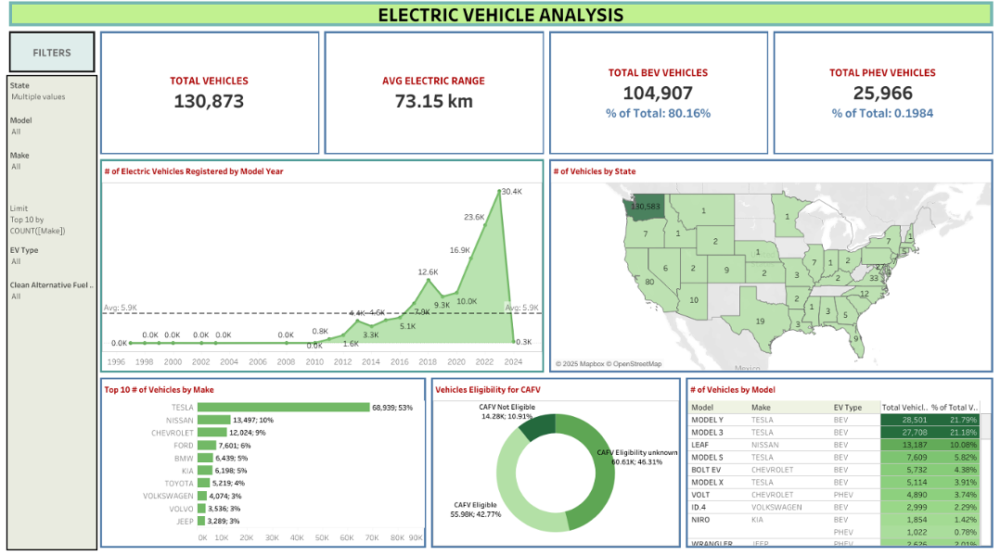

# ⚡ Electric Vehicle Population Data Analysis Dashboard

This **interactive Tableau dashboard** explores the adoption and distribution of **Electric Vehicles (EVs)** across the United States.  
Using the `Electric_Vehicle_Population_Data.csv` dataset, it highlights **market trends, manufacturer dominance, and clean fuel program eligibility**, helping **policymakers, automakers, and energy planners** track the rapid shift toward sustainable mobility.

---

## 🎯 Objectives
- Visualize **total EV adoption** across states and model years.  
- Compare **Battery Electric Vehicles (BEV)** vs. **Plug-in Hybrid Electric Vehicles (PHEV)**.  
- Identify **top manufacturers and models**.  
- Assess **Clean Alternative Fuel Vehicle (CAFV)** program eligibility.  
- Track **average electric range** and growth trends over time.

---

## 🛠️ Tools & Data
- **Tool:** Tableau Desktop  
- **Dataset:** `Electric_Vehicle_Population_Data.csv`  
- **Visuals:** KPI cards, geographic heatmaps, pie/donut charts, bar charts, and trend lines.

---

## 🚀 Implementation Highlights
- **KPIs**: Total vehicles, BEV/PHEV counts & percentages, and average electric range.
- **Top Manufacturers**: Dynamic parameter-driven Top-N bar chart of vehicle counts by make.
- **Geographic Map**: State-level heatmap of EV registrations.
- **Time-Series Trend**: Dual-axis line & area chart showing yearly registrations since 2011.
- **CAFV Eligibility**: Donut chart breaking down eligible vs. non-eligible vs. unknown.
- **Model Popularity**: Grid view of top EV models with make and type (BEV/PHEV).

Dashboard size: **1600 × 900 px**, arranged with floating KPI cards, filter panel, and responsive containers.

---

## 📊 Key Insights
1. **Total Vehicles**: **130,873** EVs recorded.  
2. **Vehicle Type**: **80.16 % BEV** vs **19.84 % PHEV**—clear dominance of pure electric vehicles.  
3. **Manufacturer Leaders**:  
   - **TESLA**: 68,939 vehicles (**~53 %** of total).  
   - **NISSAN**: 13,497 vehicles.  
   - **CHEVROLET**: 12,024 vehicles.  
4. **Popular Models**: **Tesla Model Y** and **Model 3** lead nationwide; Nissan Leaf and Chevrolet Bolt EV follow.  
5. **CAFV Eligibility**:  
   - **42.77 % Eligible**  
   - **10.91 % Not Eligible**  
   - **46.31 % Unknown** (data gaps or unverified records).  
6. **Adoption Trend**: Registrations surged **post-2015**, peaking in **2023** (~30.4K). Slight dip in 2024 may reflect incomplete data.  
7. **State Distribution**: **Washington** far ahead with **130,583 EVs**, indicating strong regional concentration.  
8. **Average Range**: **73.15 km**, suggesting many older or short-range PHEV entries.

---

## 🖼️ Dashboard Preview

---

## 🧠 Conclusion
The **Electric Vehicle Population Data Dashboard** delivers a **comprehensive, data-driven view** of U.S. EV adoption.  
It highlights:
- Rapid market growth,
- Tesla’s commanding share,
- Geographic disparities in uptake,
- And gaps in **clean-fuel eligibility reporting**.

These insights support **policy planning**, **charging infrastructure rollout**, and **market strategy** for automakers and energy agencies striving for a **sustainable, electrified future**.

