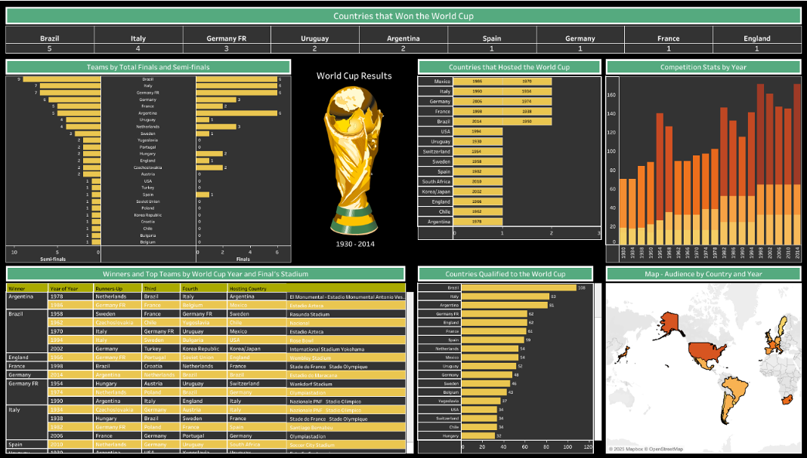

# 🌍 World Cup Results (1930 – 2014) Dashboard 

This **Tableau project** visualizes over **80 years of FIFA World Cup history**, highlighting **championship wins, team performance, hosting patterns, tournament growth, and audience engagement**.  
By combining three related sheets from the `world_cup_results.xlsx` dataset, the dashboard allows fans, analysts, and historians to explore the evolution of the world’s most celebrated football tournament.

---

## 🎯 Objectives
- Track **World Cup winners** and their frequency of victories.  
- Compare **team performance** in finals and semi-finals.  
- Show **host countries** and tournament expansion over time.  
- Visualize **audience attendance** by geography and year.

---

## 🛠️ Tools & Data
- **Tableau Desktop**  
- **Data Source:** `world_cup_results.xlsx` (tables: *WorldCups*, *WorldCupsMatches*, *World Cup – Tableau format*).  
- Visual elements: **Maps, Bar Charts, Tables, Highlight Tables**.  
- Dark theme with **green and orange accents** for a vibrant football feel.

---

## 🚀 Implementation Steps

### 1️⃣ Data Preparation
- Connected to all three sheets of `world_cup_results.xlsx`.
- Created relationships:
  - **WorldCups ↔ WorldCupsMatches** (Country)
  - **WorldCups ↔ World Cup – Tableau format** (Country)

### 2️⃣ Key Worksheets
- **Countries that Won the World Cup**  
  Count of titles per nation (black background, green title).
- **Teams by Total Finals & Semi-Finals**  
  Custom dual-axis view showing frequency of semi-final and final appearances.
- **Host Countries**  
  Bar chart of countries by number of times hosting.
- **Countries Qualified**  
  Distinct count of qualifications per team.
- **Competition Stats by Year**  
  Bar chart tracking matches played, goals scored, and qualified teams over time.
- **Winners & Top Teams Table**  
  Detailed year-wise table: winner, runner-up, 3rd & 4th place, host country, final stadium.
- **Audience Map**  
  Filled map displaying attendance by host country and tournament year.

### 3️⃣ Dashboard Assembly
- Custom size: **1850 × 1050 px**, black background.
- Placed all sheets with synchronized filters.
- Added **World Cup trophy logo** and title text: *World Cup Results (1930 – 2014)*.

---

## 📊 Key Findings
- **Most Titles:**  
  - **Brazil** leads with **5 wins**, followed by **Italy (4)** and **Germany FR (3)**.
- **Consistent Qualifiers:**  
  - **Germany** and **Brazil** have qualified **60+ times**.
- **Frequent Hosts:**  
  - **Mexico, Italy, Germany, France, and Brazil** each hosted **twice**.
- **Tournament Growth:**  
  - Matches, goals, and participating teams **rose sharply post-1970**, reflecting increasing global popularity.
- **Audience Peaks:**  
  - Massive attendance in **USA, Brazil, and Germany** tournaments.
- **Elite Performers:**  
  - **Brazil, Italy, Germany FR, and France** appear most often in semi-finals and finals.

---

## 🖼️ Dashboard Preview

---

## 🧠 Conclusion
The **World Cup Results Dashboard** offers an **interactive, historical lens** on FIFA’s premier tournament.  
Users can:
- Compare **championship records** and **team consistency**,  
- Examine **hosting patterns**, and  
- Explore **audience engagement** worldwide.

This project turns eight decades of World Cup data into a **dynamic storytelling tool**, ideal for fans, analysts, and researchers seeking rich, visual insights into global football history.
